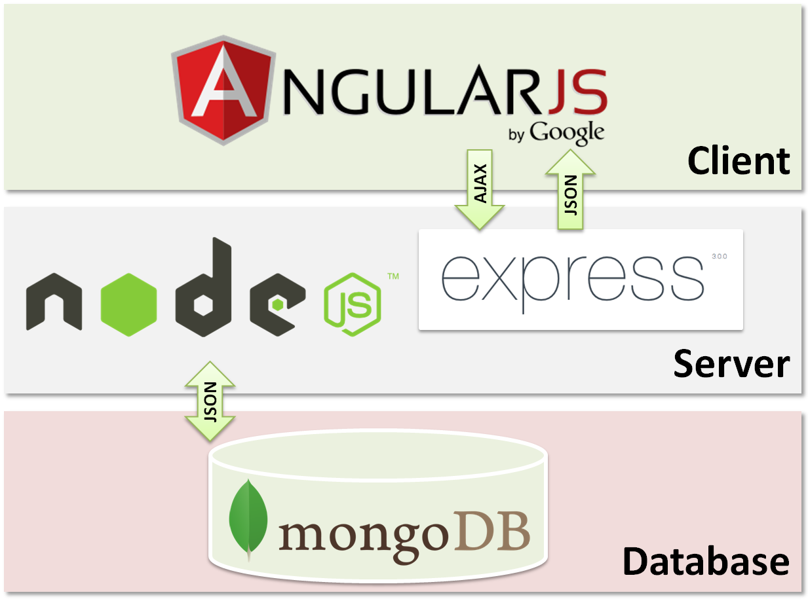
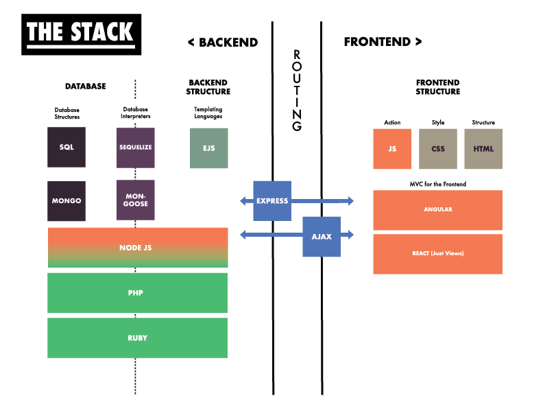

# Node, Express, EJS, and Mongo Second Pass

### Full-Stack App

The image below is a high-level (10,000 foot) view of how a full-stack app can be held together.

Here is Nick's creation for a mid-level (1,000 foot) view.

And here is Nick and my creation for the low-level (10 foot) view.

